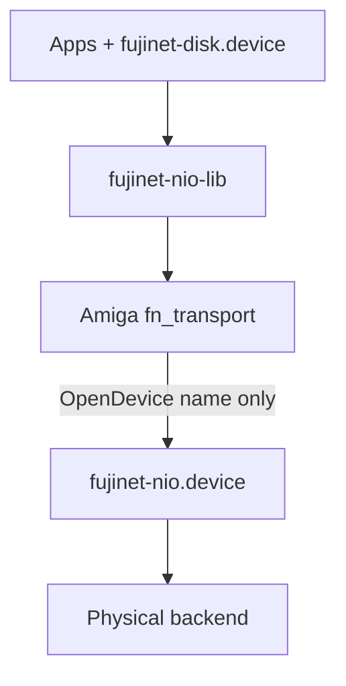
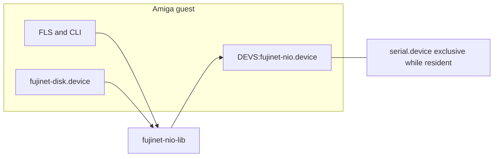

# Architecture Spine — Amiga NIO broker

Authoritative prose remains `docs/amiga/nio-broker-architecture.md`. This spine ratifies it for BMad tracking. Do not treat this file as a second design.

## Design Paradigm

**Layered broker with one FIFO worker.** Clients (apps and `fujinet-disk.device`) call `fujinet-nio-lib`. Only the Amiga transport shim opens `fujinet-nio.device`. The broker is the sole Amiga arbitrator of the physical FujiNet transport. A compiled-in backend (serial now; Zorro later as a separate binary) owns the hardware. Payload bytes are opaque.

```text
repos/fujinet-nio-lib/src/platform/amiga/   # fn_transport shim (broker client)
repos/fujinet-nio-driver/amiga/include/     # public FujiNetNIORequest ABI
repos/fujinet-nio-driver/amiga/nio.device/  # broker + serial backend (Stage 2)
repos/fujinet-nio-driver/amiga/             # fujinet-disk.device (TD_*); see amiga/README.md
```

## Invariants & Rules



### AD-1 — Dependency direction [ADOPTED]

- **Binds:** all Amiga NIO clients, lib, broker, backends
- **Prevents:** apps or `fujinet-disk.device` opening `serial.device` or `fujinet-nio.device`; backends depending on disk/service code
- **Rule:** Apps and the disk device depend only on `fujinet-nio-lib`. The lib transport shim is the only library code that names `fujinet-nio.device`. Backends depend on exec, their hardware, and framing helpers. Disk device never owns physical FujiNet transport.

### AD-2 — Service-agnostic broker [ADOPTED]

- **Binds:** `fujinet-nio.device` worker, public ABI, Amiga `fn_transport`, serial backend
- **Prevents:** DiskService/FileService/geometry interpretation in the broker; double SLIP (shim plus backend)
- **Rule:** `fn_request_data` / `fn_response_data` are opaque FujiBus frames. The broker does not parse service IDs. SLIP (or native packet wrapping) is applied only inside the physical backend. The shim submits already-encoded FujiBus bytes and receives framing-stripped payloads.

### AD-3 — Backend-neutral public ABI [ADOPTED]

- **Binds:** `FujiNetNIORequest`, all backends, all callers
- **Prevents:** serial/Zorro/SLIP fields on the public `IORequest`; forked struct layouts; caller changes when the backend changes
- **Rule:** One command `FUJINET_NIO_CMD_EXCHANGE` (`CMD_NONSTD + 0`). Base type is `IORequest`, not `IOStdReq`. The C layout in `docs/amiga/nio-broker-architecture.md` §2 is the ABI; Stage 1 `fujinet_nio_device.h` must match it. Callers own request/response buffers until reply. No baud, SLIP, or hardware fields on the struct. Stream vs packet framing is backend-internal. Near-term: one serial-backed binary as `DEVS:fujinet-nio.device`. Amiga `fn_request_length` oversize is vs `FN_MAX_PACKET_SIZE` as compiled for Amiga (1024 in `fn_protocol.h`, not the cc65 512).

### AD-4 — Two error domains and AbortIO [ADOPTED]

- **Binds:** broker `BeginIO`/`AbortIO`/worker, Amiga `fn_transport_exchange`, `fujinet-nio.h`
- **Prevents:** copying FN codes into `io_Error`; using `FN_ERR_TRANSPORT` as abort; inventing `IOERR_*` numeric literals
- **Rule:** `io_Error` is Exec/device only (`exec/errors.h` symbols). `fn_nio_error` is FN-only. Abort: `io_Error` = `IOERR_ABORTED`, `fn_nio_error` = `FN_ERR_ABORTED` (`0x13`, unused, not `FN_ERR_UNKNOWN` `0xFF`). Stage 1 adds that constant. `ReplyMsg` exactly once per request (AbortIO vs worker flag-check). Failed exchange paths set `fn_response_length` = 0. If `DoIO` returns `IOERR_ABORTED`, the shim returns `FN_ERR_ABORTED`, not a generic `FN_ERR_IO`.

### AD-5 — Transport-context IORequest ownership [ADOPTED]

- **Binds:** Amiga `fn_transport`, `fujinet-disk.device`, CLI tools
- **Prevents:** one machine-global `IORequest` shared by independent tasks (the serial race one layer up)
- **Rule:** Each independently usable transport context owns its `FujiNetNIORequest`, message port, and open flag. At most one exchange in flight per context. Two tasks must not share a `FujiNetNIORequest` unless a higher layer serializes (disk FIFO worker does). CLI may use a process-local singleton. A resident Amiga library called concurrently by independent tasks must not use one global `FujiNetNIORequest`. The disk device must use its own context, not the CLI singleton.

### AD-6 — Atomic FIFO worker [ADOPTED]

- **Binds:** broker worker, all concurrent `DoIO` callers
- **Prevents:** interleaved send/receive of two callers on one physical link
- **Rule:** One worker, unit 0 FIFO, no `IOF_QUICK` for `EXCHANGE`. The broker serializes distinct client `IORequest`s. It does not make a shared shim `IORequest` safe. Abort is completion-status only, not remote rollback. Exactly one `ReplyMsg` per request.

### AD-7 — Backend lifetime and reopen [ADOPTED]

- **Binds:** `backend_open` / `backend_close` / `backend_exchange`
- **Prevents:** treating "open once" as a resident-lifetime ban; tying backend close to `lib_OpenCnt` 0
- **Rule:** Lazy-open on first exchange; keep open. `backend_close` then `backend_open` only on expunge/shutdown or recovery after a fatal reset. `OpenCnt` 0 does not close the backend. A client's `CloseDevice` on the broker (including Stage 3/4 idle-close until Stage 4 removes it) is not `backend_close` and must not reset framing. After `backend_close`, the next open starts with clean framing/session state. Failed first open does not consume the open slot.

### AD-8 — Expunge while busy [ADOPTED]

- **Binds:** `device_expunge`, OpenCnt
- **Prevents:** freeing broker/backend memory under queued or in-progress `IORequest`s
- **Rule:** Expunge is deferred or refused while opens remain or requests are queued/in-progress. Drain/abort mechanics are Stage 2; the invariant is no unload race.

### AD-9 — BeginIO reject and shim mapping [ADOPTED]

- **Binds:** `BeginIO`, Amiga `fn_transport_exchange`
- **Prevents:** `IOF_QUICK` inline-complete; returning stale `fn_nio_error` after `DoIO` `io_Error != 0`
- **Rule:** Clear `IOF_QUICK` before any `BeginIO` `ReplyMsg`. BeginIO matrix in the architecture doc (wrong command, bad size, reserved flags/pad, NULL+nonzero, oversize, abort). Native invalid-argument symbols come from `exec/errors.h` at Stage 2. If `DoIO` returns `io_Error != 0`, the shim zeros length and returns a mapped local/device failure — except `IOERR_ABORTED` which is `FN_ERR_ABORTED` (AD-4).

### AD-10 — Staged cut-over [ADOPTED]

- **Binds:** implementation order, tests, bootstrap
- **Prevents:** Stage 2 without the ABI; dual `OpenDevice("serial.device")` during overlap; idle-close after the broker owns the wire
- **Rule:** Stage 1 blocks Stage 2. Stage 2 broker tests run isolated from the old serial-direct shim. Stage 3 is the cut-over: `fn_transport` stops opening `serial.device`. Stage 4 removes disk-device idle-close. Stage 5 is a future backend binary with the same public ABI.

### AD-11 — Second backend as Option A [ADOPTED]

- **Binds:** packaging when a non-serial backend exists
- **Prevents:** inventing a loadable-backend ABI before coexistence-without-reboot is required
- **Rule:** Separate binaries, identical public ABI, install the chosen one as `fujinet-nio.device`.

### AD-12 — Framing has no library-symbol cycle [ADOPTED]

- **Binds:** `fn_session.c`, broker serial backend build
- **Prevents:** compiling session framing into the broker while it includes library globals
- **Rule:** Before Stage 2, remove `#include "fn_internal.h"` from `fn_session.c`. Broker compiles `fn_slip.c` / `fn_session.c` by path. No source move required.

### AD-13 — Load order and missing broker [ADOPTED]

- **Binds:** Startup-Sequence, Amiberry bootstrap, `fn_transport_init`
- **Prevents:** library auto-load of resident devices; treating missing broker as serial-busy
- **Rule:** Environment loads `DEVS:fujinet-nio.device` before any `fn_transport_init` (Startup-Sequence, Amiberry test bootstrap, or user-startup). Lib does not autoload. `OpenDevice` `IOERR_OPENFAIL` maps to `FN_ERR_NOT_FOUND`, not serial-busy.

## Consistency Conventions

| Concern | Convention |
| --- | --- |
| Naming | Device `fujinet-nio.device`; command `FUJINET_NIO_CMD_EXCHANGE`; struct `FujiNetNIORequest`; unit 0 |
| Data & formats | Lengths `UWORD`; Amiga oversize vs `FN_MAX_PACKET_SIZE` 1024 (`fn_protocol.h` non-cc65). `fn_struct_size` exact-match reject until a later extension policy is named |
| Errors | Two fields, never merged; Abort pair in AD-4; BeginIO matrix in the architecture doc |
| State | One in-flight exchange per transport context; broker FIFO serializes distinct requests |
| Logging / debug | Stage 3 removes race-investigation `DBG_PRINTF` from the Amiga transport path |
| Auth | Not in scope (local Amiga device, not a network identity plane) |

## Stack

| Name | Version |
| --- | --- |
| AmigaOS guest (Workbench test envs) | 3.1 and 3.2 as in `docs/amiga/environment-setup.md` |
| exec.library / serial.device / timer.device | AmigaOS 3.x as supplied by those guests |
| amiga-gcc + NDK | workspace cross-toolchain (`scripts/env.sh` PATH / `AMIGA_TOOLCHAIN_BIN`; NDK headers from that toolchain tree) |
| fujinet-nio-lib | in-tree `repos/fujinet-nio-lib` |
| FujiBus frame bound `FN_MAX_PACKET_SIZE` | 1024 on Amiga (`fn_protocol.h` non-cc65); 512 is cc65 only |
| `FN_ERR_ABORTED` | 0x13 (Stage 1; not yet in `fujinet-nio.h`) |

## Structural Seed

```text
repos/fujinet-nio-lib/
  include/fujinet-nio.h          # FN_* codes including FN_ERR_ABORTED at Stage 1
  src/common/fn_session.c        # drop fn_internal.h before Stage 2
  src/platform/amiga/fn_transport.c  # broker client at Stage 3
repos/fujinet-nio-driver/amiga/
  include/fujinet_nio_device.h   # public ABI Stage 1
  nio.device/                    # broker + serial backend Stage 2
```



**Deploy / env:** load broker from Startup-Sequence, `S:User-Startup`, or Amiberry test bootstrap before any FujiNet tool. Integration assertions stay the same at Stage 3; only bootstrap load order changes. Serial port is exclusive to the broker while it is resident.

## Capability → Architecture Map

| Area | Lives in | Governed by |
| --- | --- | --- |
| Public broker ABI | `fujinet_nio_device.h`, `fujinet-nio.h` | AD-3, AD-4, AD-9 |
| Broker device + serial backend | `amiga/nio.device/` | AD-1, AD-2, AD-6, AD-7, AD-8, AD-11 |
| Lib transport cut-over | `fn_transport.c` | AD-5, AD-9, AD-10, AD-13 |
| Disk device idle-close removal | `fujinet-disk.device` worker | AD-5, AD-7, AD-10 |
| Isolated broker tests | Stage 2 suite in backlog | AD-10 |
| Future Zorro (or other) backend | new broker binary | AD-3, AD-7, AD-11 |

## Deferred

- Exact `exec/errors.h` symbol for generic invalid-request (Stage 2; two-domain split is fixed).
- Concrete C signatures for `backend_open` / `close` / `exchange` (semantics fixed in the architecture §11).
- Numeric exchange timeout and serial baud/unit/timer (backend-private; must time out internally; not public ABI).
- `fn_struct_size` accept-smaller-with-defaults policy (named per future ABI growth).
- Expunge drain/abort sequence beyond refuse-while-busy (Stage 2).
- Zorro/packet-native implementation and HDF/RDB media (other backlog; not this cut-over).
- Loadable-backend Option B (only if backends must coexist without reboot).
- Architecture doc still says “512 today” for `FN_MAX_PACKET_SIZE`; Amiga code is 1024 — align that prose when Stage 1 edits the ABI section.
