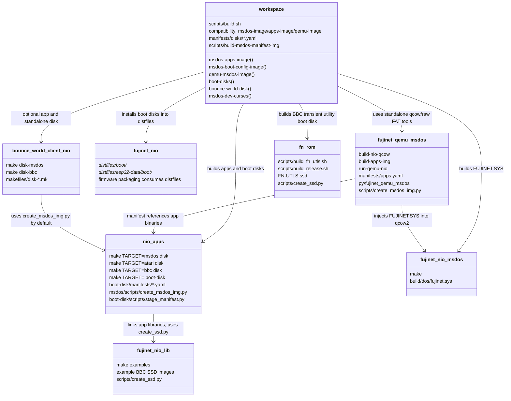

# Disk Image Build Map

This document maps the current disk-image builders in the workspace and the
repo boundaries they cross. It is intended to answer: "which target builds
which disk, and where should a new disk recipe live?"

## Current Ownership



## Build Outputs

| Command | Owner | Output | Contents | Purpose |
|---|---|---|---|---|
| `make TARGET=msdos disk` in `repos/nio-apps` | `nio-apps` | `repos/nio-apps/build/msdos/disk/nio-apps-msdos.img` | all built `nio-apps` MS-DOS binaries | repo-local app disk |
| `make TARGET=bbc disk` in `repos/nio-apps` | `nio-apps` | `repos/nio-apps/build/bbc/disk/nio-apps-bbc.ssd` | all built BBC `nio-apps` binaries | repo-local BBC app disk |
| `make TARGET=atari disk` in `repos/nio-apps` | `nio-apps` | `repos/nio-apps/build/atari/disk/nio-apps-atari.atr` | all built Atari `.xex` apps | repo-local Atari app disk |
| `make TARGET=<platform> boot-disk` in `repos/nio-apps` | `nio-apps` | `build/<target>/disk/boot/autorun.*` | files from `boot-disk/manifests/<platform>.yaml` | platform boot/config disks |
| `scripts/build.sh boot-disks` | workspace | `repos/fujinet-nio/distfiles/boot/<platform>/autorun.*` and `distfiles/esp32-data/boot/<platform>/autorun.*` | MS-DOS/Atari `nio-apps` boot disks; BBC fn-rom `FN-UTLS.ssd` installed as `autorun.ssd` | firmware boot disk inputs |
| `scripts/build.sh bbc-boot-disk` | workspace via `fn-rom` | `repos/fujinet-nio/distfiles/boot/bbc/autorun.ssd` and `distfiles/esp32-data/boot/bbc/autorun.ssd` | `FN-UTLS.ssd`, the BBC transient assembly utilities that call the resident ROM ABI | BBC firmware boot utility disk |
| `scripts/build.sh master-boot-disk` | workspace via `fn-rom` | `repos/fujinet-nio/distfiles/boot/bbc/autorun.ssd` and `distfiles/esp32-data/boot/bbc/autorun.ssd` | `FN-UTLS-M.ssd`, the Master transient assembly utilities plus `CONFNIO` | BBC Master firmware boot utility disk |
| `scripts/build.sh confnio-master-disk` | workspace via `nio-apps` | `build/images/confnio-master.ssd` | `CONFNIO` only, built from `repos/nio-apps/build/bbc/bin/config-nio` with load/exec `$0E00` | standalone Master config-nio disk for TNFS/manual testing |
| `scripts/build.sh msdos-apps-image` | workspace via `fujinet-qemu-msdos` raw FAT tool | `build/images/msdos-apps.img` | files from `manifests/disks/msdos-apps.yaml` | mountable raw FAT app image |
| `scripts/build.sh msdos-boot-config-image` | workspace via `fujinet-qemu-msdos` raw FAT tool | `build/images/msdos-boot-config.img` | `FUJINET.SYS` plus config/utilities from `manifests/disks/msdos-boot-config.yaml` | mountable raw FAT driver/config disk |
| `scripts/build.sh qemu-msdos-image` | workspace via `fujinet-qemu-msdos` | `repos/fujinet-qemu-msdos/build/msdos-nio-apps.qcow2` | base MS-DOS hard disk plus `FUJINET.SYS`, `CONFIG.SYS`, `AUTOEXEC.BAT` PATH update, and apps from `manifests/disks/qemu-msdos-apps.yaml` under `C:\FNAPPS`; also refreshes installed `nio-apps` boot disks | bootable QEMU hard disk |
| `scripts/build.sh msdos-image` | workspace compatibility alias | `build/images/nio-apps.img` plus `build/images/msdos-apps.img` | same as `msdos-apps-image` | old target name |
| `scripts/build.sh apps-image` | workspace compatibility alias | `build/images/msdos-nio-apps.img` plus `build/images/msdos-apps.img` | same as `msdos-apps-image` | old target name |
| `scripts/build.sh qemu-image` | workspace compatibility alias | `repos/fujinet-qemu-msdos/build/msdos-nio-apps.qcow2` | same as `qemu-msdos-image` | old target name |
| `scripts/build.sh bounce-world-disk` | workspace via `bounce-world-client-nio` | `build/images/bwcn-msdos.img` | `BWCN.EXE` only | standalone game disk |
| `make disk-msdos` in `repos/bounce-world-client-nio` | `bounce-world-client-nio` | `disk-images/msdos/bwcn-msdos.img` | `BWCN.EXE` only | repo-local game disk |
| `scripts/build_fn_utls.sh` in `repos/fn-rom` | `fn-rom` | `build/FN-UTLS.ssd` or caller-supplied `FN_UTLS_SSD` | BBC/Master transient ROM utilities linked against the matching machine ROM ABI | BBC ROM release utility disk |

## Coupling Observed

The current coupling is mostly functional, but the names make it hard to know
which layer owns a disk.

- `scripts/build.sh` is the real workspace orchestrator. It knows every repo
  path and passes environment variables into sub-repo tools.
- `repos/fujinet-qemu-msdos` contains a generally useful MS-DOS manifest image
  builder, but it is named and packaged as QEMU tooling.
- `scripts/build.sh msdos-image` and `scripts/build.sh apps-image` are now
  compatibility aliases for `msdos-apps-image`.
- `repos/nio-apps/msdos/scripts/create_msdos_img.py` and
  `repos/fujinet-qemu-msdos/scripts/create_msdos_img.py` are duplicate copies
  of the same MS-DOS FAT image creator.
- `repos/nio-apps/boot-disk/manifests/*.yaml` and
  `repos/fujinet-qemu-msdos/manifests/apps.yaml` are similar manifest concepts
  with different staging scripts.
- `repos/fujinet-nio` does not build these disks. It consumes installed images
  from `distfiles/boot` and `distfiles/esp32-data/boot` during POSIX/firmware
  packaging.

## Recommended Boundaries

Use this rule:

- A repo-local disk belongs in the repo that owns the files.
- A disk composed from more than one repo belongs to the workspace.
- `fujinet-nio` should consume finished boot/config images, not know how to
  build them.
- QEMU-specific tools should build/run QEMU images, not be the public home for
  general workspace disk composition.

That gives these practical owners:

| Disk kind | Recommended owner |
|---|---|
| `nio-apps` boot disks copied to firmware `distfiles` | `nio-apps`, orchestrated by workspace, except BBC |
| BBC firmware boot utility disk | `fn-rom`, installed by workspace as `autorun.ssd` |
| raw MS-DOS app/config disk containing `FUJINET.SYS` plus utilities | workspace |
| bootable QEMU hard disk image | `fujinet-qemu-msdos`, orchestrated by workspace |
| BBC SSD utility disks for ROM release | `fn-rom` |
| BBC/Atari/MS-DOS per-app disks | owning app repo |

## Current Workspace Manifests

Cross-repo disk composition now lives under:

```text
manifests/disks/
  msdos-apps.yaml
  msdos-boot-config.yaml
  qemu-msdos-apps.yaml
```

The workspace wrapper:

```text
scripts/build-msdos-manifest-img
```

calls `repos/fujinet-qemu-msdos/build-apps-img` with `--repo-root` set to the
workspace. This keeps `fujinet-qemu-msdos` standalone for upstreaming while
giving the workspace a stable, non-QEMU-named entry point for raw FAT images.

`fujinet-qemu-msdos` still keeps its own `manifests/apps.yaml` for standalone
development and tests. Workspace builds should use `manifests/disks/*.yaml`.

`manifests/disks/qemu-msdos-apps.yaml` is intentionally narrower than the raw
app disk manifest. It contains the FujiNet command/config tools that should be
present on the bootable DOS hard disk, and the QEMU builder installs them into
`C:\FNAPPS` rather than the root of `C:\`. The old direct diagnostics
`NIOPROBE.EXE`, `NIOREAD.EXE`, and `NIODUMP.EXE` are retired from workspace
disk manifests.

The QEMU repo runner remains generic. It accepts `--nio-boot-disk <path>`, but
does not know where workspace boot disks live. The workspace `qemu-run` target
passes `repos/fujinet-nio/distfiles/boot/msdos/autorun.img` as the default boot
disk path after `qemu-msdos-image` refreshes boot disks. No writable scratch
disk is mounted by default; pass `--nio-scratch-disk` only for tests that need
one.

The BBC boot disk is intentionally different from the nio-apps BBC app disk.
The DISK+NET ROM leaves commands such as `*FLS` and `*FDRIVE` out of ROM and
expects to load transient assembly utilities from `FN-UTLS.ssd` or
`FN-UTLS-M.ssd`. Those utilities are built in `repos/fn-rom` against the
target machine's resident ROM interface. Resident routine calls go through the
fixed utility ABI jump table at `$8030`, so routine implementation movement
inside the ROM does not require a matching utility disk rebuild as long as the
jump-table slot order remains stable. The BBC and Master disks are still
separate today because the transient binaries also use direct workspace/data
symbols, those addresses differ between machines, and the load/exec address is
machine-specific: BBC utilities load at `$1900`, while Master utilities load at
`$0E00`.

The workspace injects `nio-apps` `config-nio` into the Master utility disk as
`$.CONFNIO`, and can also build it as a standalone SSD with
`scripts/build.sh confnio-master-disk`. The same app currently does not fit the
BBC `$1900` load address; `confnio-bbc-disk` is intentionally left as a build
target that exposes that overflow until the BBC UI is reduced further.

For example `*FLS` requests FileDevice formatted directory lines
(`sort | formatted`, flag `$06`) and uses a BBC-safe page size. If
`repos/nio-apps/build/bbc/bin/fls` is staged as `FLS` on the boot disk instead,
the request becomes the C app binary-listing request (`sort` only, flag `$02`)
and can exceed the BBC ROM raw device-call packet workspace.

## Longer-Term Centralization

The next cleanup is a small shared disk tool package, for example:

```text
tools/disk-image/
  pyproject.toml
  fujinet_disk_image/
    manifest.py
    msdos.py
    bbc.py
    qemu.py
  scripts/
    build-disk
```

Responsibilities:

- one manifest loader with environment expansion and `required: false`
- one MS-DOS raw FAT image creator
- one BBC SSD staging wrapper around the chosen `create_ssd.py`
- one QEMU qcow injector wrapper or thin import of the QEMU-specific injector
- clear artifact profiles such as `msdos-apps`, `msdos-boot-config`,
  `qemu-msdos-apps`, `bbc-boot`, `atari-boot`

`repos/fujinet-qemu-msdos` cannot depend on workspace paths because it is a fork
that needs to remain independently pushable upstream. Do not solve the duplicate
`create_msdos_img.py` scripts by making that repo reach into `nio-apps` or the
workspace. A better future answer is either:

- publish/import a small shared Python package used by both repos, or
- keep the duplicate repo-local scripts but make the workspace wrapper the only
  cross-repo entry point.

## Mountable MS-DOS Config Disk

Build the driver/config utility disk with:

```sh
./scripts/build.sh msdos-boot-config-image
```

Expected output:

```text
build/images/msdos-boot-config.img
```

The target builds `fujinet-nio-msdos` and `nio-apps` first, then stages this
workspace manifest:

```text
manifests/disks/msdos-boot-config.yaml
```

The manifest contains:

```yaml
apps:
  - src: ${FUJINET_NIO_MSDOS}/build/dos/fujinet.sys
    name: FUJINET.SYS
  - src: ${NIO_APPS_MSDOS_BIN}/config-nio.exe
    name: CONFNIO.EXE
  - src: ${NIO_APPS_MSDOS_BIN}/fboot.exe
    name: FBOOT.EXE
  - src: ${NIO_APPS_MSDOS_BIN}/fdrive.exe
    name: FDRIVE.EXE
  - src: ${NIO_APPS_MSDOS_BIN}/fhost.exe
    name: FHOST.EXE
  - src: ${NIO_APPS_MSDOS_BIN}/fin.exe
    name: FIN.EXE
  - src: ${NIO_APPS_MSDOS_BIN}/fls.exe
    name: FLS.EXE
  - src: ${NIO_APPS_MSDOS_BIN}/fmount.exe
    name: FMOUNT.EXE
```

That target should be workspace-owned because it combines `FUJINET.SYS` from
`fujinet-nio-msdos` with utilities from `nio-apps`.

## Cleanup Plan

1. Done: add workspace manifests under `manifests/disks/`.
2. Done: add explicit workspace targets:
   - `msdos-apps-image`
   - `msdos-boot-config-image`
   - `qemu-msdos-image`
3. Done: keep `msdos-image`, `apps-image`, and `qemu-image` as compatibility
   aliases temporarily.
4. Done: add `scripts/build-msdos-manifest-img` as the workspace raw FAT wrapper.
5. Later: harmonize the duplicated `create_msdos_img.py` scripts through a
   shared package or by making the workspace wrapper the cross-repo API.
6. Keep `fujinet-qemu-msdos/build-nio-qcow` focused on bootable QEMU hard disks.
7. Keep `nio-apps/boot-disk/*` as the owner for platform firmware boot disks
   unless the manifests become cross-repo.
8. Done: update `build/manifest.txt` to record every disk artifact path and the
   manifest used to produce it.

The important change is not technical; it is naming and ownership. A target
whose output is a raw mountable FAT image should not be named or documented as a
QEMU image, and a target that combines files from several repositories should
live at the workspace layer.
